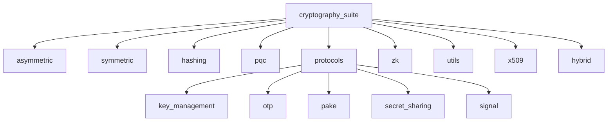

# Package Architecture

```mermaid
graph TD
    CS[cryptography_suite]
    CS --> asymmetric
    CS --> symmetric
    CS --> hashing
    CS --> pqc
    CS --> protocols
    CS --> zk
    CS --> utils
    CS --> x509
    CS --> hybrid
    protocols --> key_management
    protocols --> otp
    protocols --> pake
    protocols --> secret_sharing
    protocols --> signal
```
