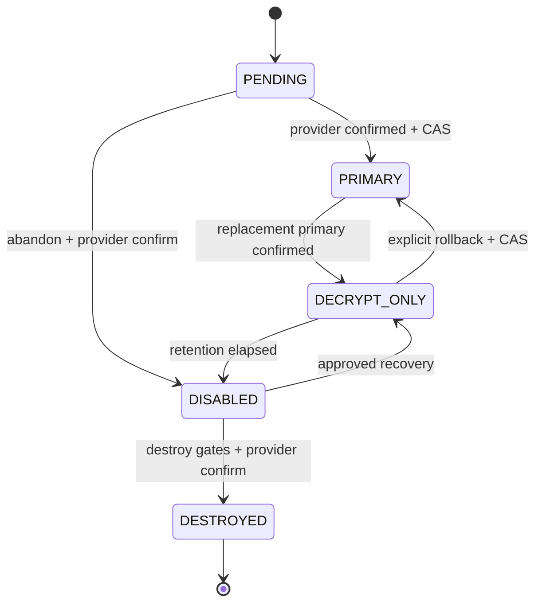
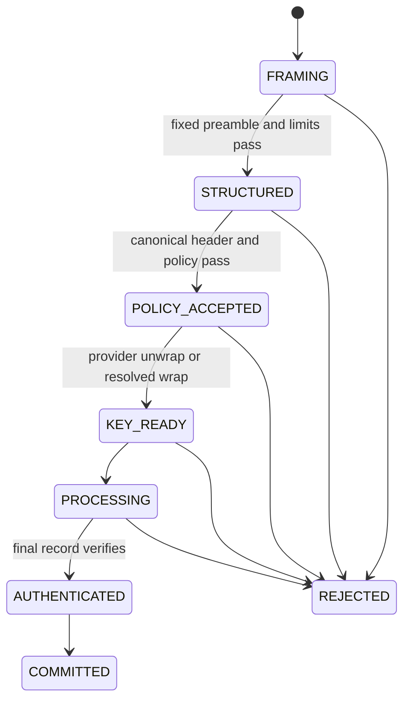
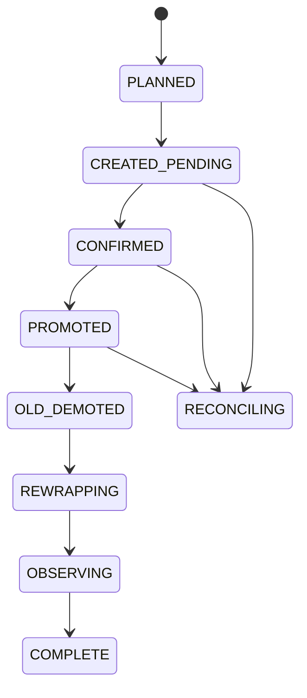
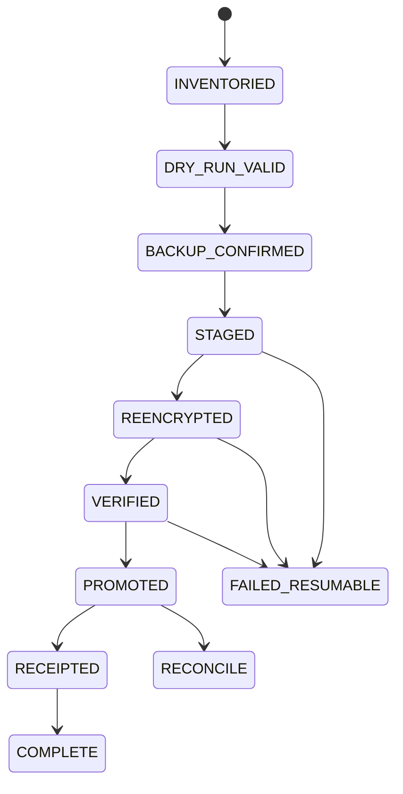

# v4 State Machines

- **Status:** Proposed for v4 implementation
- **Last updated:** 2026-07-29

Every transition is persisted with operation/idempotency id and emits the named
secret-free audit event. “Failure state” is durable when external mutation may
have occurred; otherwise the operation returns to its pre-state.

## Key lifecycle

| Transition | Preconditions / operation | Success / failure state | Retry safety, audit, rollback |
| --- | --- | --- | --- |
| create → `PENDING` | Idempotency key; provider accepts create | `PENDING`; ambiguous result → `PENDING_RECONCILE` operational substate | Retry only provider-idempotent request; `key.created`; reconcile by describe, never duplicate blindly |
| `PENDING` → `PRIMARY` | Exact version enabled, wrap/unwrap capable; no competing primary; generation CAS | Sole `PRIMARY`; CAS/provider uncertainty leaves `PENDING` | Same CAS id safe; `key.promoted`; rollback disables/abandons pending version |
| `PENDING` → `DISABLED` | No envelope uses version; provider confirms disable | `DISABLED`; otherwise `PENDING`/reconcile | Idempotent disable; `key.disabled`; re-enable only through recovery |
| `PRIMARY` → `DECRYPT_ONLY` | New primary already confirmed; CAS | Old `DECRYPT_ONLY`; failure keeps effective state stricter and blocks rotation completion | Idempotent by generation; `key.demoted`; rollback may explicitly re-promote |
| `DECRYPT_ONLY` → `PRIMARY` | Policy/dual control; provider enabled; no competing primary | `PRIMARY`; failure stays `DECRYPT_ONLY` | CAS-safe; `key.promoted` reason rollback; undo by demotion after replacement |
| `DECRYPT_ONLY` → `DISABLED` | Retention/inventory gates; not sole required decrypt version | `DISABLED`; failure remains decrypt-only/reconcile | Provider-idempotent; `key.disabled`; approved re-enable possible |
| `DISABLED` → `DECRYPT_ONLY` | Not destroyed; recovery approval; provider re-enabled | `DECRYPT_ONLY`; failure remains disabled | Reconcile provider state; `key.recovered`; disable again |
| `DISABLED` → `DESTROYED` | Earliest time, inventory, retention, dual approval, audit checkpoint | terminal `DESTROYED`; ambiguity → `DESTROY_RECONCILE` and deny use | Never blind retry; `key.destroyed`; no rollback |

`PRIMARY → DESTROYED`, multiple primaries, any transition from `DESTROYED`, and
promotion from local metadata alone are invalid and audited as denied.

## Envelope processing

| Transition | Preconditions / operation | Success / failure | Retry, audit, rollback |
| --- | --- | --- | --- |
| start → `FRAMING` | Fixed input handle/bytes | bounded preamble; invalid → `REJECTED` | Read-only retry safe; `envelope.started`; no output |
| `FRAMING` → `STRUCTURED` | Checked lengths within hard limits | restricted deterministic-CBOR model; malformed → rejected | Deterministic; `envelope.rejected`; discard parse state |
| `STRUCTURED` → `POLICY_ACCEPTED` | Version/suite/critical/quota/context/provider allowed | accepted; denial → rejected before provider | Re-evaluate only same policy id; `policy.decision`; no output |
| `POLICY_ACCEPTED` → `KEY_READY` | Explicit provider/key version/capability | internal DEK; transient provider failure remains retryable pre-processing | RFC-0006 retry; `provider.call`; release secret on failure |
| `KEY_READY` → `PROCESSING` | Staging available | records processed; any auth/order/I/O/cancel → rejected | Seal retry creates new DEK/envelope; open read retry safe; remove owned staging |
| `PROCESSING` → `AUTHENTICATED` | Final record/manifest and context verified | authenticated staging; failure rejected | No retry from partial state unless sealed resumable profile later; `envelope.authenticated` |
| `AUTHENTICATED` → `COMMITTED` | Output policy/link/fsync checks | bytes return or atomic promotion; promotion failure retains source/staging per policy | Idempotent destination transaction; `envelope.completed`; rollback removes owned staging |

## Streaming encryption

States are `INIT → KEY_WRAPPED → HEADER_WRITTEN → CHUNKS → FINAL_WRITTEN →
SYNCED → COMMITTED`. Before `KEY_WRAPPED`, policy and immutable provider version
must pass. Each `CHUNKS` transition reads at most the policy chunk, increments
exactly one index, authenticates index/length/final flag/header digest, and
checks cancellation. Final writes authenticated count/length/manifest.

Failure before commit closes/release secrets and removes SDK-owned temporary
output; existing destination is unchanged. A retry is a new envelope with a new
DEK/idempotency key unless no provider mutation occurred. Events:
`stream.seal.started`, per-policy coarse progress, `stream.seal.completed` or
`stream.seal.failed`. Rollback never deletes caller source.

## Streaming decryption

States are `INIT → HEADER_ACCEPTED → KEY_UNWRAPPED → CHUNKS_STAGED →
FINAL_AUTHENTICATED → SYNCED → COMMITTED`. Each record must be the next index,
within declared/actual limits, and nonempty unless final. Missing/duplicate/
reordered/trailing records transition to `FAILED`.

Plaintext remains in SDK-owned staging through `CHUNKS_STAGED`; no final sink is
committed until `FINAL_AUTHENTICATED`. Failure/cancellation removes staging and
leaves pre-existing output unchanged. Open is read-only/provider-idempotent and
may restart from byte zero; partial plaintext is never resumed. Events:
`stream.open.started/completed/failed`.

## Rotation

| Transition | Preconditions / operation | Failure and retry | Audit / rollback |
| --- | --- | --- | --- |
| plan → pending | Policy, approvals, unique operation/generation | Creation ambiguity → reconcile; retry only idempotent | `rotation.started`; abandon confirmed-unused version |
| pending → confirmed | Fresh provider description exact version/capability | Stay/reconcile; never local promotion | `key.confirmed`; disable pending on cancellation |
| confirmed → promoted | CAS makes sole primary | CAS loser reconciles to winning primary | `key.promoted`; explicit previous-version rollback |
| promoted → old demoted | New primary independently confirmed | Block completion if demotion uncertain | `key.demoted`; may restore old if policy permits |
| demoted → rewrapping | Durable inventory/idempotency queue | Per-envelope failures retained, bounded retry | `rotation.rewrap_progress`; original envelopes retained |
| rewrapping → observing → complete | Required coverage/soak/retention met | Remain observing; no premature disable/destroy | `rotation.completed`; later lifecycle gates independent |

## Rewrap

States: `PARSED → POLICY_ACCEPTED → SOURCE_DEK_UNWRAPPED →
DESTINATION_VERSION_CONFIRMED → DESTINATION_WRAPPED → RECIPIENT_AUTH_UPDATED →
VERIFIED → COMMITTED`.

Preconditions are canonical v4 envelope, allowed source/destination providers,
immutable versions, and idempotency key. Ciphertext records are copied exactly.
Same source/destination version returns the canonical original and is idempotent.
Any failure before commit returns the original unchanged and releases the DEK.
Ambiguous destination wrap reconciles through provider semantics; it is never
blindly duplicated. `VERIFIED` checks recipient/header integrity, exact
ciphertext digest equality, and metadata; content status is “preserved, not
reverified” unless actually verified. Events are
`rewrap.started/completed/failed`; rollback discards the new envelope.

## Migration

| Transition | Preconditions / operation | Failure/retry | Audit/rollback |
| --- | --- | --- | --- |
| inventory/dry run | Named format, source digest, quotas, deadline, context/key capacity | Quarantine malformed; retry read-only with same digest | `migration.inventoried/validated`; no writes |
| backup → staged | Caller backup confirmation; destination/link policy; durable id | Collision fails; same id/digest resumes | `migration.staged`; remove owned temp |
| staged → reencrypted | Declared legacy decrypt then v4 seal | Auth/provider/cancel → resumable/failed, no promotion | `migration.reencrypted`; source retained |
| reencrypted → verified | Independent v4 reopen and keyed stream digest/length compare | Verification failure quarantines output | `migration.verified`; discard staged envelope |
| verified → promoted | Fsync and atomic same-filesystem replace | Ambiguous crash → reconcile filesystem/digests | `migration.promoted`; source/backup retained |
| promoted → receipted/complete | Durable receipt and audit checkpoint | Mandatory sink failure → reconcile, not false success | `migration.completed`; rollback uses caller backup/retains both |

Source deletion is not a transition in this machine.

## Provider health

States are `UNKNOWN`, `HEALTHY`, `DEGRADED`, `UNAVAILABLE`, and
`MISCONFIGURED`. Explicit health check maps successful full check to `HEALTHY`,
partial/rate-limited dependency to `DEGRADED`, transient reachability to
`UNAVAILABLE`, permanent credential/config to `MISCONFIGURED`, and cancelled/
unclassifiable to `UNKNOWN`. Checks are read-only and retry only under RFC-0006.
`provider.health` records safe state/latency bucket. Health transitions have no
cryptographic rollback and never override actual call/policy results.

## Release maturity

`ALPHA → BETA → RC1_FROZEN → AUDITED → REMEDIATION_VALIDATED →
SOAKED → STABLE` follows RFC-0010. Any failed gate remains at the prior state;
format/API freeze exception returns to `BETA` for affected evidence. Promotion
requires linked artifacts/approvals and is not retryable by workflow alone.
`release.promoted` records commit/artifact digests and approvers; rollback
withdraws/quarantines artifacts but never reuses a version.
