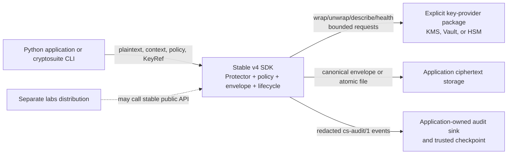
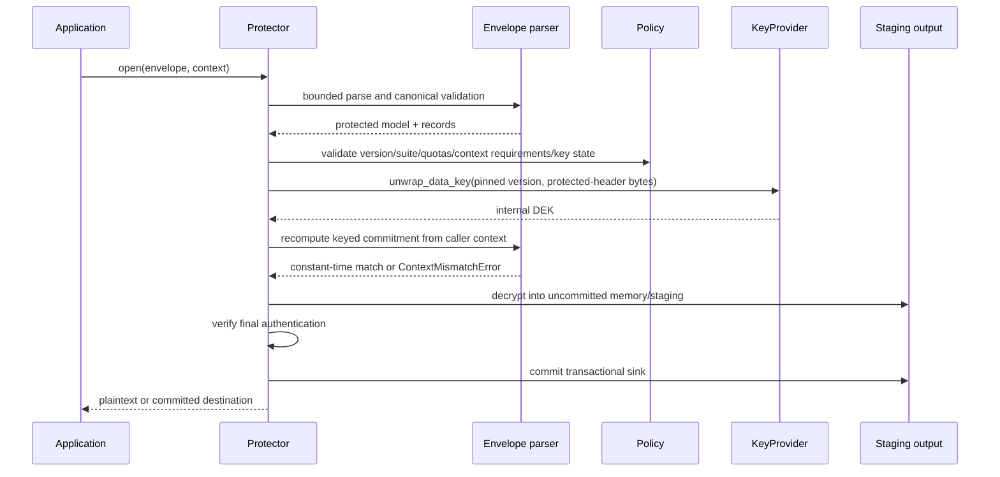
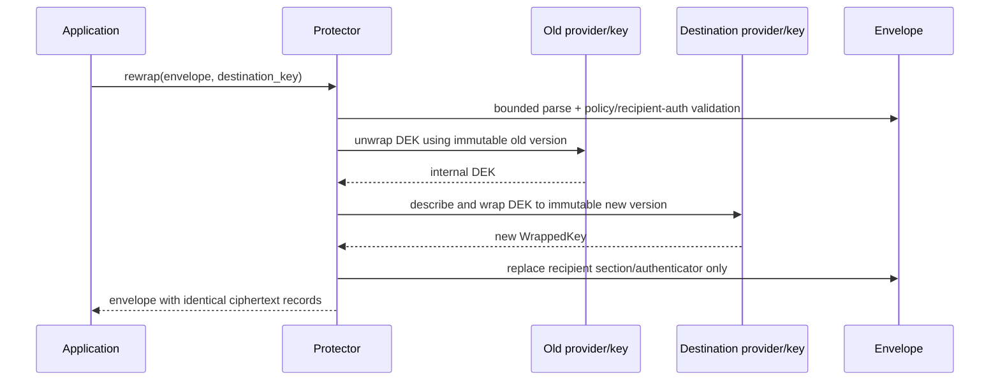
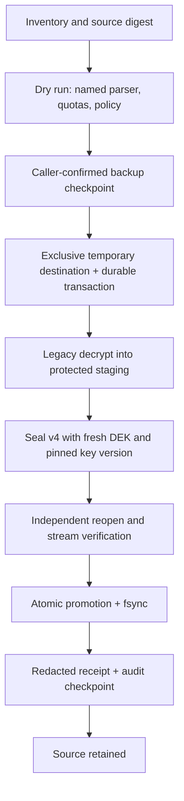

# v4 Target Architecture

- **Status:** Proposed for v4 implementation
- **Last updated:** 2026-07-29
- **Authority:** [RFC-0001](../rfcs/RFC-0001-product-charter.md) through
[RFC-0010](../rfcs/RFC-0010-release-support-and-assurance.md)

## System context

The SDK protects application bytes/files. The application owns plaintext
purpose, provider credentials/configuration, key aliases, policy selection,
audit sink, and final data retention. The provider owns long-term wrapping keys
and authoritative version/state. The SDK owns envelope parsing, quotas,
DEK/nonce generation, the DEK-keyed context commitment, transactional staging,
and redaction.



There is no stable-core-to-labs edge. Ciphertext storage is untrusted. Provider
responses are authenticated by provider SDK/transport but still schema-checked
and policy-checked. Audit availability/integrity is policy-defined and does not
substitute for cryptographic authentication.

## Runtime components and trust boundaries

| Component | Responsibility | Trust boundary |
| --- | --- | --- |
| `Protector` | Orchestrate seal/open/inspect/rewrap | Validates caller models; never exposes DEK |
| Policy evaluator | Pure deterministic authorization/quotas | Treat policy documents and provider descriptions as untrusted data until validated |
| Envelope codec | Fixed preamble, restricted deterministic CBOR, records | Treat all envelope bytes as attacker-controlled |
| Suite adapter | Maintained-library AEAD/key-wrap binding | Receives internal DEK/nonce; no caller algorithm controls |
| Provider adapter | Four-method normalized provider contract | Network/SDK/token errors and metadata are untrusted |
| Lifecycle service | CAS state, rotation, reconciliation, destroy gates | Durable application store may be stale/concurrent |
| Streaming/sink/atomic service | Bounded writes, commit/abort, fsync/promotion | Sink state, filesystem names, links, mounts, capacity, and crashes are hostile conditions |
| Legacy service | One explicitly named bounded parser at a time | Legacy bytes/metadata/password inputs are hostile and weaker |
| Audit service | Build/redact/deliver structured events | Sink may fail or be unavailable; never receives secrets |
| CLI | Parse explicit configuration and map output/errors | argv, stdin, config, TTY, signals, and output paths are untrusted |

## Seal data flow

```mermaid
sequenceDiagram
    participant A as Application
    participant P as Protector
    participant Y as Policy
    participant K as KeyProvider
    participant E as Envelope/Suite
    participant U as Audit

    A->>P: seal(plaintext, context)
    P->>Y: validate operation, bounds, context, primary KeyRef
    Y-->>P: allow + effective policy id
    P->>K: describe_key(alias, deadline)
    K-->>P: immutable version + capabilities/state
    P->>P: generate fresh DEK and internal nonce
    P->>E: canonical context + DEK; derive keyed commitment
    E-->>P: deterministic protected-header bytes
    P->>K: wrap_data_key(DEK, version, protected-header bytes)
    K-->>P: WrappedKey
    P->>E: protected header + wrapped key + plaintext
    E-->>P: Envelope
    P->>U: redacted seal.completed
    P-->>A: immutable Envelope
```

No provider call occurs before structural/policy validation. The internal DEK
exists only for the operation and provider call; Python zeroization is best
effort, not guaranteed.

## Open data flow



Any failure discards staging. Authentication and context mismatch have distinct
codes but equally non-oracular default messages.

## Inspect and rewrap data flow

`inspect` performs fixed framing, restricted-CBOR, quota, critical-field, and
policy checks only. It makes no provider/network call and returns redacted
metadata with `authentication_status = not_verified`. It may return an opaque
context-commitment identifier, never context values or a public hash presented
as protection for low-entropy values.



Rewrap reports content authentication as preserved, not reverified, unless the
content tag was actually verified. Failure leaves the original envelope valid.

## Streaming behavior and failure boundary

Both safe stream operations receive an `OPEN` `TransactionalSink`. Seal reads
one policy-bounded chunk, encrypts/authenticates its index/length/header binding,
and performs bounded sink writes. It appends a final authenticated manifest,
then commits. Open verifies the keyed context commitment after DEK unwrap,
decrypts records through bounded uncommitted writes, rejects missing/duplicate/
reordered/trailing records, verifies the final record, then commits.
Cancellation is checked before provider calls, every chunk, and commit.

Authentication, context, quota, cancellation, provider, and I/O failure invoke
idempotent abort. No committed output is externally visible before `commit`.
Pipes, sockets, stdout, and arbitrary already-open `BinaryIO` outputs are not
accepted by the safe API. The SDK filesystem sink implements same-directory
staging, no-overwrite/link checks, fsync, atomic promotion, and directory fsync
from [RFC-0007](../rfcs/RFC-0007-policy-model.md).

## Migration data flow



Failures before promotion remove only owned staging and retain the transaction
record. Failures after promotion retain source and destination for explicit
rollback/reconciliation.

## Policy and provider interaction

Pre-provider evaluation order is hard limits, policy validity, format/profile,
quotas, context shape/required keys, operation permission, provider allowlist,
and fresh key description/effective state. Open then unwraps using
protected-header bytes, verifies the keyed context commitment, and only then
processes plaintext. Provider health is advisory and cannot override operation
results. Provider selection is constructor-owned, never ambient or
insertion-ordered.

## Audit event generation

The orchestrator emits start/result/transition events to the audit service. The
redactor uses a field allowlist; sinks never receive plaintext, context values,
passwords, credentials, DEKs, wrapped bytes, nonces, ciphertext, full paths, or
raw provider exceptions. Required sink failure blocks before mutation or enters
durable `AUDIT_PENDING` reconciliation after an irreversible external mutation.

## Secret and metadata ownership

| Asset | Owner at rest | SDK handling |
| --- | --- | --- |
| Plaintext | Application | Operation memory/staging only; never logs/metadata |
| DEK | No caller persistence; wrapped in envelope | Fresh per envelope, internal mutable buffer, best-effort release |
| Long-term wrapping key/credentials | Provider/application | Never exported or serialized by core |
| Context values | Application | Canonically encoded; DEK-keyed commitment stored; values never stored or sent to providers |
| Wrapped DEK/key version | Envelope/application storage | Visible bounded metadata; policy-redacted on inspect/audit |
| Policy document | Application governance | Validated/canonicalized; identifier stored |
| Audit events/checkpoints | Application audit system | Allowlisted redacted schema |

## Assurance status

This is a target contract, not implemented architecture. The previous Deep
Security Scan failed because a discovery worker did not produce required
`threat_model.md`; its manifest/partials are rejected. A fresh successful
independent scan and external audit remain Phase 4/stable prerequisites.
