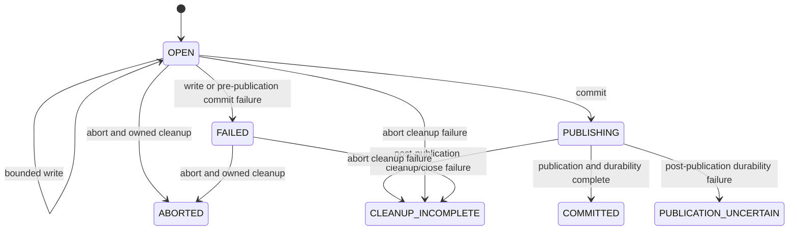

# Phase 4A transactional filesystem contract

- **Status:** implementation contract
- **Rollback checkpoint:** `fc50585b280dd9bb76c7671f1932a6d80bc4f06e`
- **Scope:** internal, non-cryptographic filesystem mechanics only

## Responsibility and scope

`cryptography_suite.streaming.atomic` supplies an internal
`TransactionalSink` implementation. It accepts bounded `bytes`, keeps them
under an operation-owned staging name, and publishes them only on an explicit
commit. It is not exported by the package root or by
`cryptography_suite.streaming`.

The sink does not encrypt, decrypt, authenticate, hash caller data, invoke a
provider, evaluate policy, parse an envelope, run a CLI, or delete a caller's
source. `Protector` remains fail-closed.

## Trusted root and untrusted relative destination

The caller supplies:

1. an explicit absolute trusted output root that already exists; and
2. an untrusted relative destination below that root.

The implementation never obtains either value from the current working
directory or environment. The root is opened without following a final link.
It must be a directory owned by the effective caller and must not permit
group/other writes on POSIX. Windows requires a local NTFS root and retains
non-reparse directory handles while the transaction is active.

The relative path grammar rejects empty paths, absolute/anchored/drive/UNC
paths, NUL, `.` and `..`, empty components, repeated separators, alternate
separators, and platform-reserved or invalid names. Parent directories must
already exist. No parent is created.

POSIX traverses each parent with directory-relative `open`, `O_DIRECTORY`, and
`O_NOFOLLOW`. Windows opens and retains each parent using `CreateFileW` with
`FILE_FLAG_BACKUP_SEMANTICS | FILE_FLAG_OPEN_REPARSE_POINT` and rejects every
reparse point. Lexical validation is only the first check; it is not described
as a race-proof containment mechanism.

POSIX passes Unicode strings to the native filesystem unchanged. macOS
filesystem normalization aliases remain filesystem-defined. Windows rejects
trailing spaces/dots, reserved DOS device basenames, alternate data stream
syntax, and invalid Win32 filename characters. Windows case comparison and
normalization remain filesystem-defined.

## Link and file-identity rules

Destination inspection never follows a final symlink or reparse point. An
existing directory or a file whose link count exceeds one is rejected. When a
caller supplies an already-open source descriptor, the sink records its native
file identity and compares that identity with the destination during
construction and immediately before publication. The source handle remains
caller-owned and is never closed or deleted.

POSIX identity is device plus inode from `fstat`/directory-relative `stat`.
Windows identity is volume serial plus file index from
`GetFileInformationByHandle`. These values never enter exception text, repr,
logs, or public metadata.

For an existing overwrite destination, construction also retains an open
destination handle. Commit compares the retained object with the immediately
reinspected name before publication. On POSIX the retained handle prevents
inode reuse from making a delete-and-recreate race look unchanged. Windows
opens the retained target with delete sharing and uses POSIX-semantics replace
flags so the handle can remain open through atomic replacement.

## Temporary ownership and permissions

Staging occurs exclusively in the destination's existing parent. A random
nonsecret name is created with an exclusive create primitive and contains no
source name, destination name, tenant, context, key, or data-derived value.
The retained open handle and native identity establish ownership.

POSIX creates with mode `0600`, applies `fchmod(0600)`, and verifies the mode.
Windows creates with a protected DACL granting full control only through the
owner-rights SID and verifies the resulting DACL. A platform/filesystem that
cannot establish the permission property fails closed.

Cleanup reopens or stats the staging name without following links and compares
its identity with the retained identity. An identity mismatch is never
unlinked.

## Bounds and writes

The immutable internal options object represents a future policy decision. It
contains maximum write size, maximum total bytes, policy overwrite authority,
and operation overwrite intent. It is not a public policy schema. Boolean
values are rejected where integer bounds are required, caller bounds cannot
exceed hard implementation ceilings, and overwrite defaults to false.

`write` accepts exact `bytes`. Empty `bytes` is an accepted no-op. Each chunk
and the checked cumulative total are validated before writing. Interrupted and
partial system writes are retried until complete. A failed write makes the
transaction non-committable but leaves deterministic abort available.

## Publication

Commit is permitted once from the open state:

1. flush the retained file handle with the platform file-durability primitive;
2. revalidate staging identity;
3. revalidate destination type, link count, and optional source identity;
4. atomically publish within the already-open parent;
5. perform the platform directory/rename durability barrier; and
6. close owned handles.

No copy-and-delete or cross-filesystem fallback exists.

### No overwrite

No overwrite is the default. POSIX creates the destination atomically with
`linkat` semantics and then removes only the owned staging name. Windows uses
handle-based `SetFileInformationByHandle(FileRenameInfoEx)` without the
replace flag. A concurrent destination causes a stable `OUTPUT_EXISTS`
failure. Exactly one no-overwrite publisher can win.

### Overwrite

Replacement is enabled only when both the future-policy authority flag and the
operation-intent flag are true. An absent destination still uses the
no-overwrite primitive so a newly appearing object is not replaced without
inspection. A safely inspected existing destination is replaced atomically:
POSIX uses same-directory `replace`; Windows uses handle-based rename with
`FILE_RENAME_FLAG_REPLACE_IF_EXISTS | FILE_RENAME_FLAG_POSIX_SEMANTICS`.

The staged permission is the final permission; source or old-destination mode
is not inherited.

## Durability and ambiguous outcomes

POSIX performs file `fsync`, publication, staging-name cleanup, and containing
directory `fsync`. Windows performs `FlushFileBuffers` before publication and
uses a write-through file handle plus a post-rename `FlushFileBuffers` metadata
barrier on local NTFS. Windows does not claim a portable POSIX directory-fsync
API.

Internal outcomes are:

- `NOT_PUBLISHED`;
- `PUBLISHED`;
- `PUBLISHED_DURABILITY_UNCERTAIN`; and
- `CLEANUP_INCOMPLETE`.

A file-sync or promotion failure before publication leaves the old destination
unchanged and permits abort. A failure of the post-publication durability
barrier raises a typed uncertain error, keeps the destination, and prevents
abort from claiming an aborted result. A failure removing a post-link staging
name reports cleanup incomplete and never removes the destination.

## Abort

Abort is idempotent. Before publication it closes the staging handle, verifies
the staging identity, and removes only that owned name. It never removes the
destination or source. After commit it is a no-op with respect to the
destination. After an uncertain or cleanup-incomplete publication it may
retry cleanup of a distinct owned staging name but never changes the outcome
to aborted.

No destructor is relied upon for cleanup or correctness.

## Errors and redaction

Internal filesystem errors use existing stable codes `IO_FAILED`,
`OUTPUT_EXISTS`, `LIMIT_EXCEEDED`, and `INTERNAL_ERROR`. Messages and reprs
contain no trusted root, relative destination, temporary name, source or
destination identity, staged bytes, or raw operating-system exception text.

## State diagram

## Unsupported behavior

Relative-path roots, missing parents, writable-by-other POSIX parents, remote
or non-NTFS Windows roots, reparse/link parents, unverifiable owner-only
permissions, unavailable atomic publication, and unavailable durability
barriers fail closed. Network shares, cross-filesystem publication, backups,
automatic source deletion, stale-temp scanning, and recovery scanning are not
implemented.
